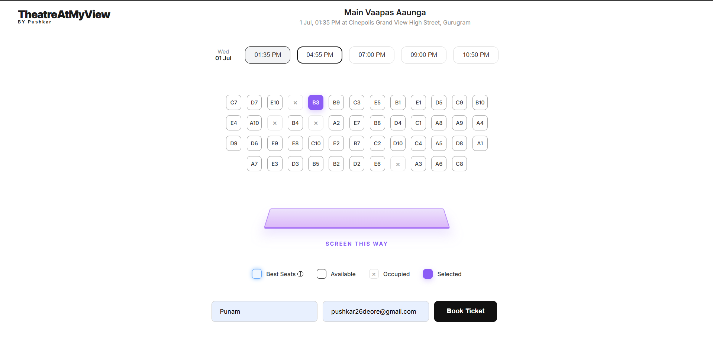

# Movie Seat Reservation System

An AWS-powered movie seat booking application with a clean seat-selection UI, Lambda backend, DynamoDB storage, and SNS confirmation support.

## Overview

This project lets users browse a seat layout, select an available seat, enter booking details, and confirm a reservation through a serverless backend.

## Features

- Interactive seat map with available, occupied, selected, and best-seat states
- Booking form for name and email
- Seat availability loaded from the backend API
- Duplicate booking prevention using DynamoDB conditional updates
- Booking record storage in DynamoDB
- Email confirmation support through Amazon SNS
- CORS-enabled Lambda API for frontend integration

## Screenshot

Add your uploaded screenshot to the repository as `bookMyShow/screenshot.png`, then keep this line in place so it renders on GitHub:



## Tech Stack

- Frontend: HTML, CSS, JavaScript
- Backend: Python AWS Lambda
- Database: Amazon DynamoDB
- Notifications: Amazon SNS
- API layer: Amazon API Gateway

## Project Structure

```text
BookMyShow/
├── bookMyShow/
│   ├── index.html
│   ├── script.js
│   └── style.css
├── insert_seats.py
├── lambda_function.py
├── README.md
└── .gitignore
```

## How It Works

1. The frontend loads all seats from the `GET /seats` endpoint.
2. The user selects one available seat from the layout.
3. The booking form sends the selected seat, name, and email to the `POST /book` endpoint.
4. The Lambda function marks the seat as booked, stores the booking record, and sends a confirmation message.

## Backend Details

The main handler is [lambda_function.py](lambda_function.py).

It supports:

- `GET` for returning all seat records
- `POST` for booking a selected seat
- `OPTIONS` for CORS preflight requests

AWS resources used by the backend:

- DynamoDB table: `MovieSeats`
- DynamoDB table: `Bookings`
- SNS topic: `movie-ticket-confirmation`

## Setup

### Frontend

1. Open the `bookMyShow` folder.
2. Open `index.html` in a browser or serve it with a local web server.
3. Update the API URL in [bookMyShow/script.js](bookMyShow/script.js) if your backend URL changes.

### Backend

1. Create the required DynamoDB tables.
2. Deploy [lambda_function.py](lambda_function.py) to AWS Lambda.
3. Connect the Lambda function to API Gateway.
4. Configure the SNS topic for booking confirmations.
5. Update the frontend API URL to match the deployed API Gateway endpoint.

## API Endpoints

- `GET /seats` - fetch all seat records
- `POST /book` - book a selected seat

## Configuration Notes

- The API URL is currently hardcoded in [bookMyShow/script.js](bookMyShow/script.js).
- Seat booking uses a conditional update so two users cannot book the same seat at the same time.
- You can edit the movie title, theater name, and timings directly in [bookMyShow/index.html](bookMyShow/index.html).

## Author

Pushkar
